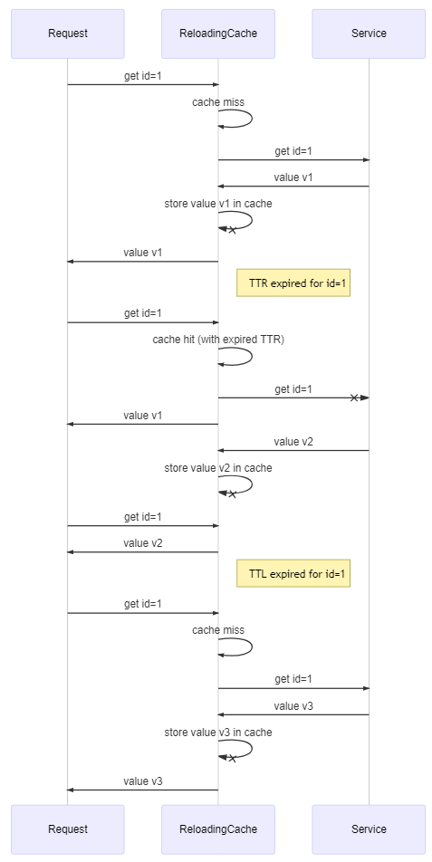

# Molten-cache

Molten-cache provides reactive cache solutions based on the interface [ReactiveCache](src/main/java/com/hotels/molten/cache/ReactiveCache.java) that has only 2 methods:
 - `Mono<V> get(K key);`
 - `Mono<Void> put(K key, V value);`
 
This has great benefit if your class providing the values you would like to cache also has reactive interface. 
 
## Implementations
 
### ReactiveMapCache

[ReactiveMapCache](src/main/java/com/hotels/molten/cache/ReactiveMapCache.java) is a `Map` based implementation, which can be used for simple use-cases.
On the other hand it can be also useful if your caching implementation implements `java.util.Map`.

### ReactiveGuavaCache

[ReactiveGuavaCache](src/main/java/com/hotels/molten/cache/ReactiveGuavaCache.java) is a wrapper for the [Google's Guava Cache](https://github.com/google/guava/wiki/CachesExplained).

### ReactiveCaffeineCache

[ReactiveCaffeineCache](src/main/java/com/hotels/molten/cache/ReactiveCaffeineCache.java) is a wrapper for [Caffeine](https://github.com/ben-manes/caffeine).

### ReactiveReloadingCache

[ReactiveReloadingCache](src/main/java/com/hotels/molten/cache/ReactiveReloadingCache.java) is a wrapper for another `ReactiveCache` and intended to keep
cached items up to date. In contrast with a simple `TTL`-based approach where accessing an expired item triggers
an expensive service call that the consumer need to wait for, if the item is expired in terms of the `TTR` then it still be returned and will be refreshed
asynchronously without affecting the consumer.

It can give huge performance improvement over a simple `TTL`-based solution depending on
the response time of the underlying service and the value of the `TTR` acceptable for your use-case.

It is a good practice to wrap a `TTL`-based `ReactiveCache` implementation. In this case ensure that `TTR` < `TTL`,
which results asynchronous update of frequently used elements also removing rarely accessed items from the cache.
This works best if all or most of the cached elements fit in the cache thus no eviction happens due to size limitation.

## Example

Imagine a service that provides stock prices. We need to integrate this service thus we introduce the following interface.

```java
interface StockPriceService {
    Mono<StockPrice> currentPrice(Symbol symbol);
}
```

Accessing this service (the real implementation) requires a network call, which means it can be slow.
In order to mitigate this we decide to cache the values. The example below has 1 hour long TTL and 1 minute long TTR.
It means accessed values are refreshed every minute but if a certain price is not accessed for an hour then it will be evicted.

```java
public class CachingStockPriceService implements StockPriceService {
    private final ReactiveCache<Symbol, StockPrice> reactiveCache;
    
    public CachingStockPriceService(StockPriceService realStockPriceService) {
        reactiveCache = ReactiveReloadingCache.<Symbol, StockPrice>over(
                new ReactiveCaffeineCache<>(Caffeine.newBuilder()
                    .maximumSize(1000)
                    .expireAfterWrite(1, TimeUnit.HOURS)
                    .build()))
            .loadingWith(realStockPriceService::currentPrice)
            .withTimeToRefresh(Duration.ofMinutes(1))
            .build();
    }
    
    @Override
    public Mono<StockPrice> currentPrice(Symbol symbol) {
        return reactiveCache.get(symbol);
    }
}
```

## Combining with a TTL-based cache

The following diagram explains how [ReactiveReloadingCache](src/main/java/com/hotels/molten/cache/ReactiveReloadingCache.java) works with a `TTL`-based cache.



## Resiliency

You can use the [ResilientReactiveCacheBuilder](src/main/java/com/hotels/molten/cache/resilience/ResilientReactiveCacheBuilder.java) to put together
a resilient cache instance over a non-resilient named one, with
- circuit-breaker
- timeout
- optional retry mechanism
- either in failsafe or consolidated errors mode.

```java
ReactiveCache<NamedCacheKey<Integer>, CachedValue<List<String>> namedReactiveCache;

ReactiveCache<Integer, List<String>> reactiveCache = ResilientReactiveCacheBuilder.builder()
    .over(namedReactiveCache)
    .withCacheName("cacheName")
    .withTimeout(Duration.ofMillis(50))
    .withRetries(3)
    .withRetryDelay(Duration.ofMillis(retryDelayInMs))
    .withFailsafe(FailSafeMode.LOGGING)
    .withTTL(Duration.ofHours(12))
    .withCircuitBreakerConfig(CircuitBreakerConfig.custom()
        .failureRateThreshold(75)
        .waitDurationInOpenState(Duration.ofMillis(5000))
        .slidingWindow(10, 10, CircuitBreakerConfig.SlidingWindowType.COUNT_BASED)
        .permittedNumberOfCallsInHalfOpenState(50)
        .build())
    .withMeterRegistry(meterRegistry)
    .createCache();
```

If you need to have bulkhead then you can wrap the inner or outer cache in [ResilientSharedReactiveCache](src/main/java/com/hotels/molten/cache/resilience/ResilientSharedReactiveCache.java).

```java
ReactiveCache<Integer, List<String>> resilientCache = new ResilientSharedReactiveCache<>(nonResilientCache, "cacheName", maxConcurrency, metricRegistry);
```
