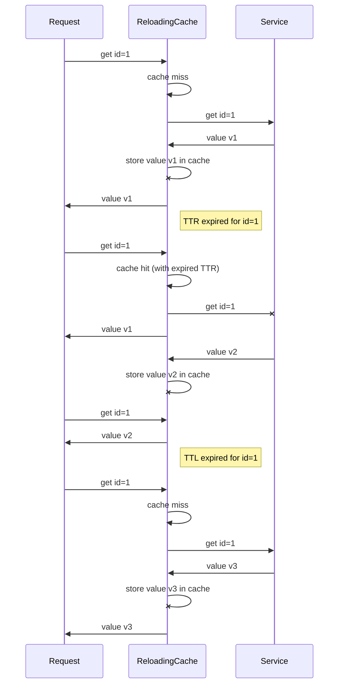
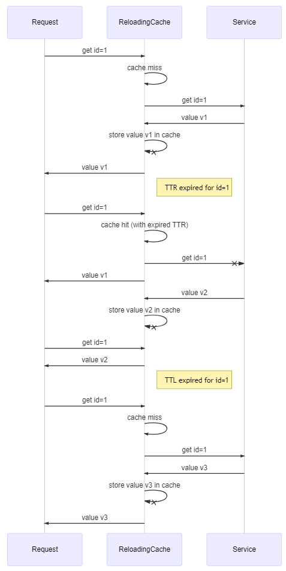

# Reactive reloading cache
Reactive caching implementation with async cache entry reloading.
Cache both has TTL (time to live) and TTR (time to refresh). TTL > TTR

```mermaid
    sequenceDiagram
      participant r as Request
      participant rc as ReloadingCache
      participant s as Service
      r->>rc: get id=1
      rc->>rc: cache miss
      rc->>s: get id=1
      s->>rc: value v1
      rc-xrc: store value v1 in cache
      rc->>r: value v1
      Note right of rc: TTR expired for id=1
      r->>rc: get id=1
      rc->>rc: cache hit (with expired TTR)
      rc-xs: get id=1
      rc->>r: value v1
      s->>rc: value v2
      rc-xrc: store value v2 in cache
      r->>rc: get id=1
      rc->>r: value v2
      Note right of rc: TTL expired for id=1
      r->>rc: get id=1
      rc->>rc: cache miss
      rc->>s: get id=1
      s->>rc: value v3
      rc-xrc: store value v3 in cache
      rc->>r: value v3
      
```

