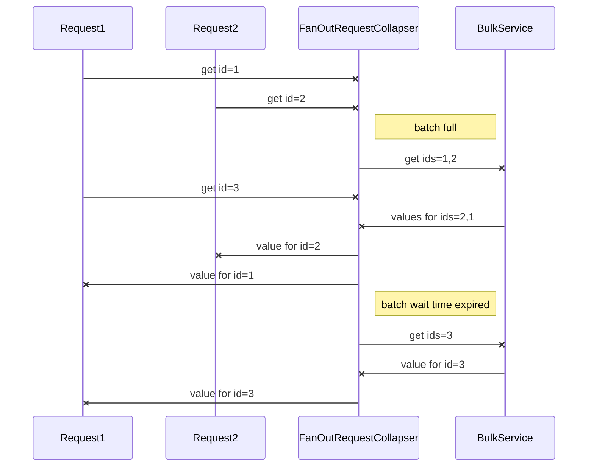
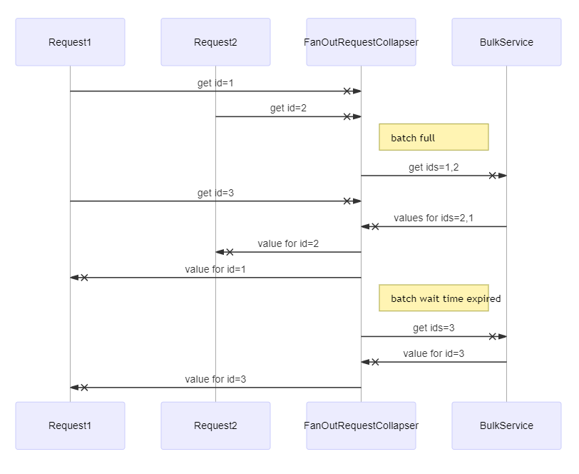

# Fan-out request collapser
Executes individual calls in batches. 
For detailed information and configuration options please see `com.hotels.molten.core.collapser.FanOutRequestCollapser`.

## Fan-out request collapser with batch size 2

