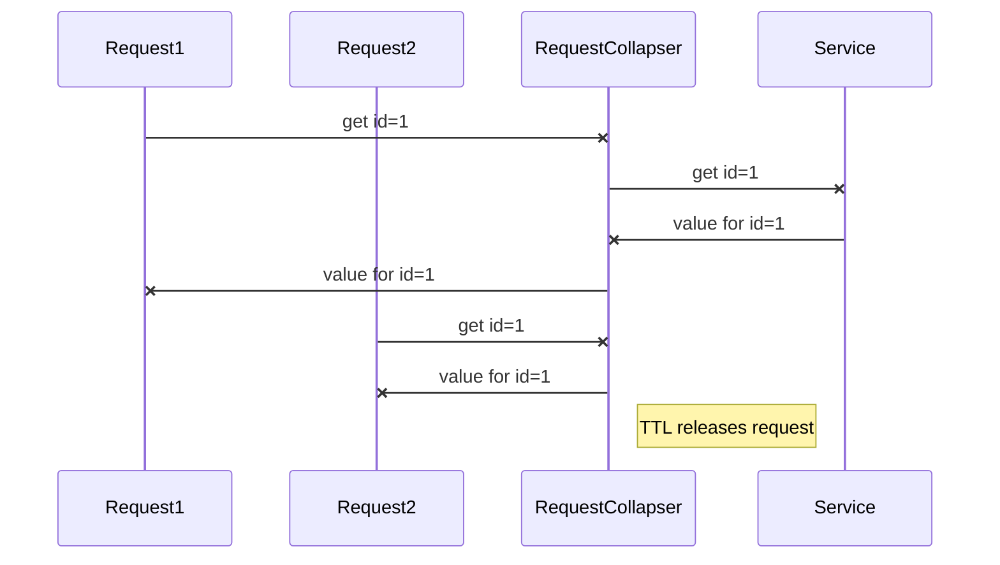
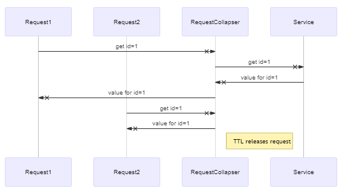
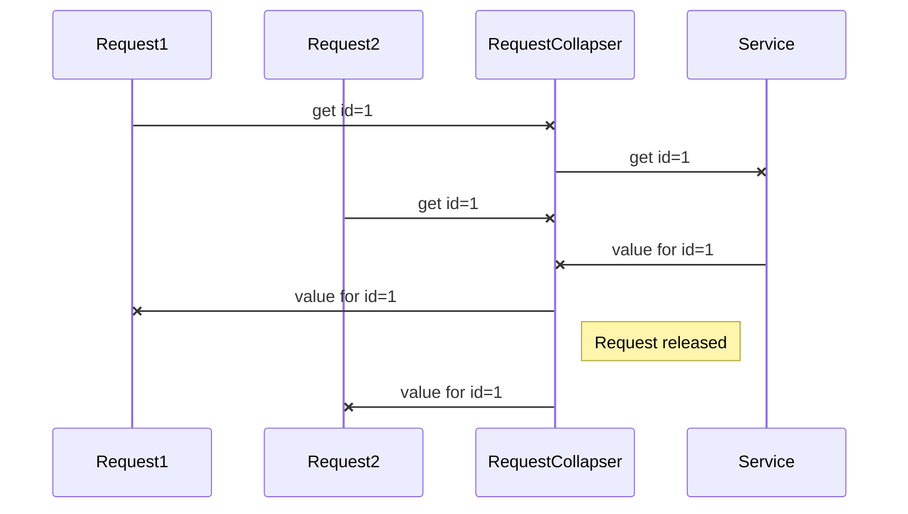
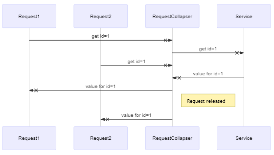

# Request collapser
Deduplicates similar calls happening in a short time-window. 
For detailed information and configuration options please see `com.hotels.molten.core.collapser.RequestCollapser`. 

## Request collapsing with release on TTL expiration

## Request collapsing with release when finished

