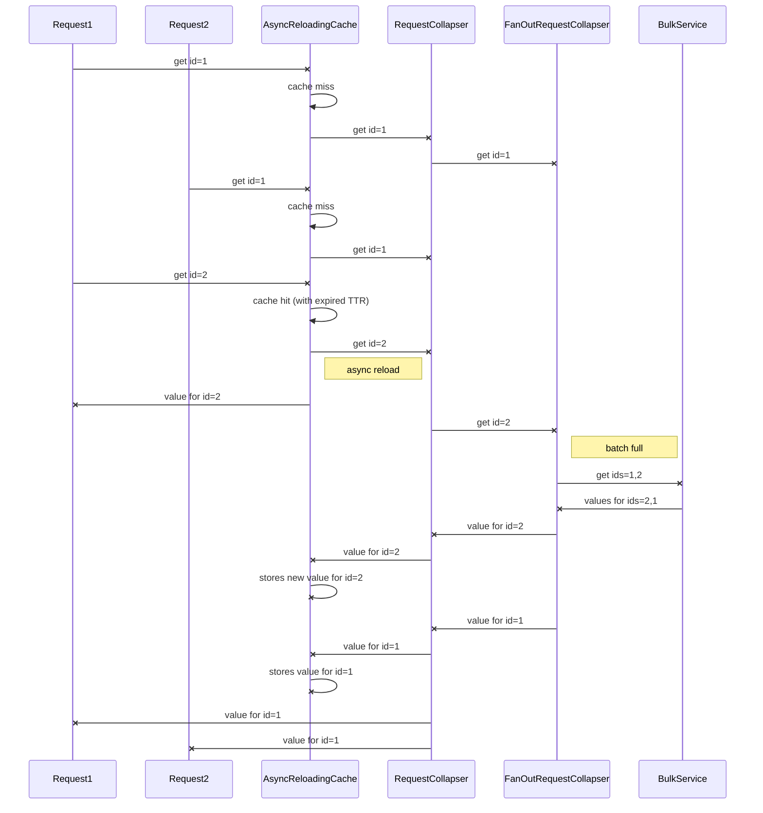
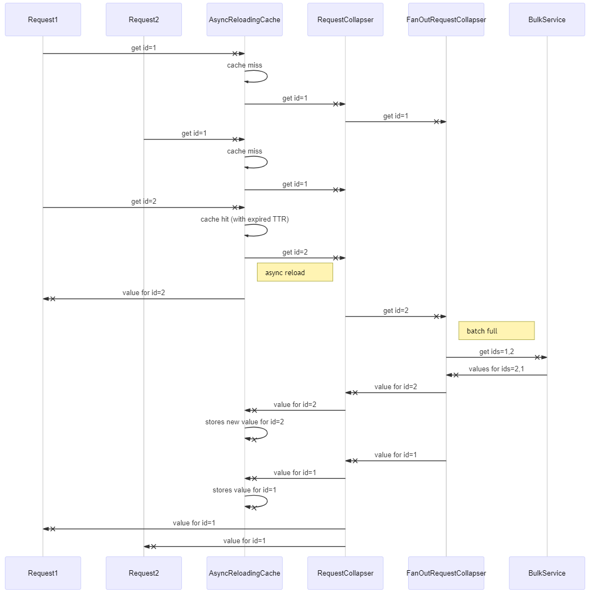

# Request collapser integration pattern
The following pattern can be used to make service invocations globally cached, deduplicated, and bulk.  

## Async reloading cache over request collapser over fan-out request collapser with batch size 2

For async reloading cache implementation please see `ReactiveReloadingCache` in `molten-cache` module.
